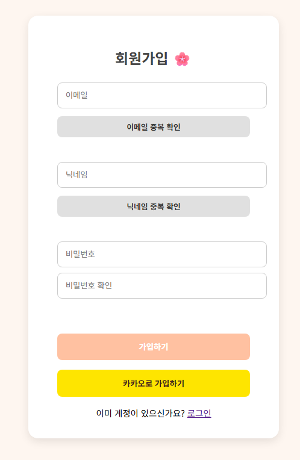
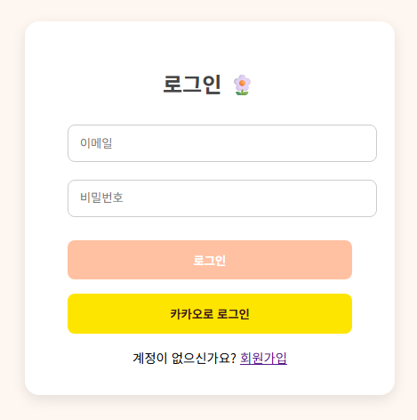
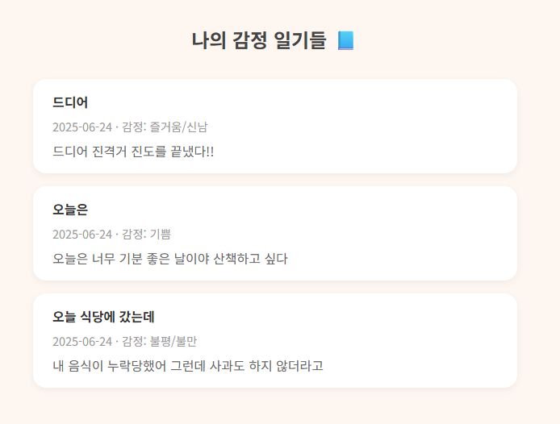
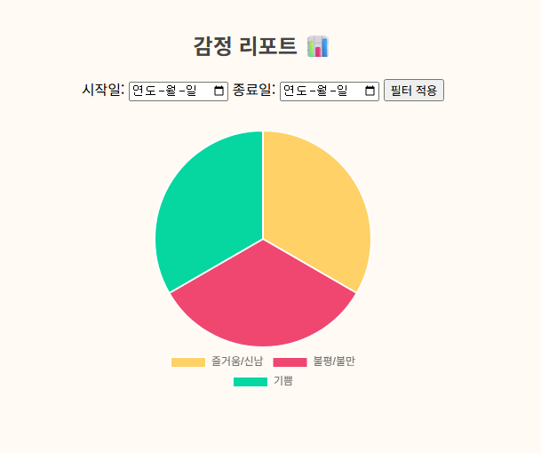
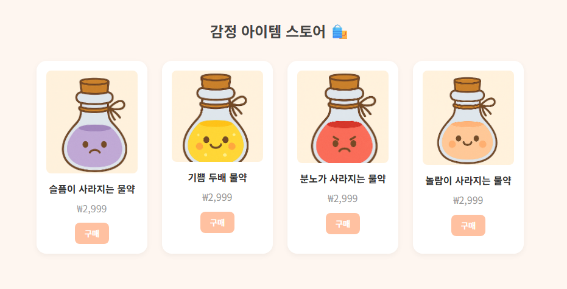
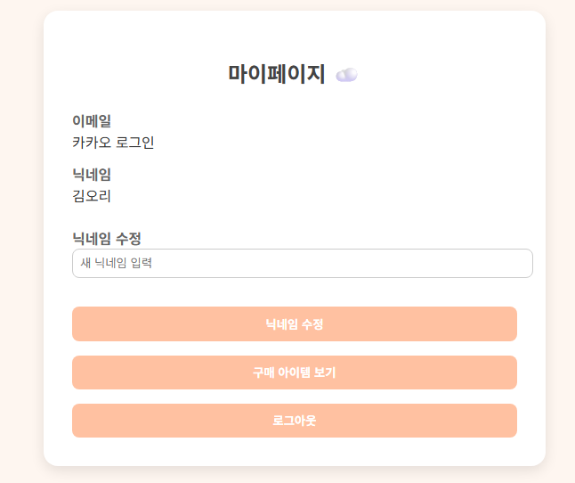
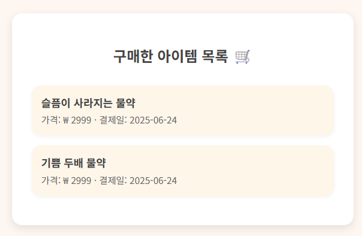

# ☁️ 몽글몽글 (MongleMongle) - 감정 일기 

감정을 글로 기록하고, AI가 분석하여 시각화해주는 감성 일기 플랫폼입니다!
 
사용자가 작성한 일기를 바탕으로 감정을 분석하고, 감정 리포트, 감정 아이템 구매 등 다양한 기능을 제공합니다.

---

## 🛠 기술 스택

### 🖥 Frontend

### ⚙ Backend

### 🤖 Machine Learning / AI

### 📊 Visualization

### 💳 Payment Integration

---

## 🌈 주요 기능

### 🔐 회원가입 및 로그인
- 로컬 회원가입, 카카오 OAuth 로그인 기능 제공
- 로그인 후 세선 유지 (닉네임 표시 및 사용자 정보 접근)

 
  
  

### ✍️ 감정 일기 작성
- 일기 작성 시 감정을 자동 분석 (Hugging Face 모델 기반)
- 감정 분석 버튼을 누르면 Flask API 호출 → 감정 예측 결과 표시 및 저장

 
  

### 📃 감정 일기 목록
- 사용자별 작성된 일기를 목록 형태로 조회
- 감정/날짜/내용 요약 정보 표시
- 일기 클릭 시 상세 페이지로 이동

 
  

### 📊 감정 리포트
- 기간별 감정 빈도 통계를 파이 차트로 시각화

 
  

### 🛍️ 감정 아이템 스토어
- 감정과 연결된 아이템을 구매 가능 (ex. 분노가 사라지는 물약)
- 카카오페이 결제 연동 완료
- 결제 내역 저장 및 조회 기능 포함

 
  

### 👤 마이페이지
- 사용자 정보 확인 및 닉네임 수정
- 구매한 감정 아이템 내역 조회

 
  
  

---

## 🧠 감정 분석 모델

- 사용 모델: [`searle-j/kote_for_easygoing_people`](https://huggingface.co/searle-j/kote_for_easygoing_people)
- 분류 방식: 감정 다중 레이블 분류 (sigmoid 적용)
- API 구현: Flask + Huggingface `transformers` 라이브러리
